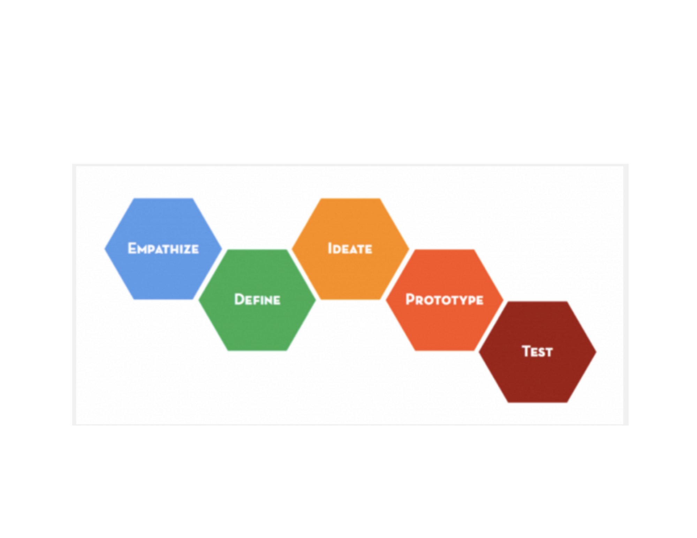

## Brainstorming and the Iterative Design Process

### Iterative Design
For your projects, we'll emphasize an **Iterative** Design process, demonstrated visually with the following pipeline.

#### Empathize
Understand what a client/user needs.  Put yourself in their position to be able to decide what sort of functionality would be valuable for them.

#### Define
Explicitly define the problem you're attempting to solve, including all known parameters.

#### Ideate
Effectively, this is the *brainstorming* step, in which you think deeply about various approaches, functionality, issues, etc (more below).

#### Prototype
This is any working copy of the system you're trying to build that solves the problem at hand.  We're not so much concerned with how well it solves that problem--that's what the testing and iteration are for.

#### Test
Test your prototypes and see how well they do!  

##### Definition of Done
Make sure you have specified (probably in the Define step) just how good is "good enough".  Write this down formally early on to make yourself stop when you've reached this point and avoid the famous trap encapsulated by the saying "better is the enemy of good enough".

#### Where's the Iteration?
Ideate --> Prototype --> Test --> Repeat 

### Brainstorming for Benson

#### Steps

1. Expansion Stage:
Go wild. Get lots of ideas, including stupid ones.
*Note: Stupid ideas are poison to your brain, so get them out! Also, they're also often brilliant ideas with a piece missing. Say your stupid ideas.*
1. Grouping Stage:
Find themes in the ideas you've spewed out and group them together
1. Refine/Edit Stage:
Pick the good ones and discard the stupid ideas that didn't end up inspiring brilliance, after all
1. Voting Stage:
Pick your course of action. Don't put undue significance on this step. It's important, but in the real world, if you're using iterative design, you'll have many chances to refine things later.

#### 7 Rules for brainstorming

1. defer judgment
2. encourage wild ideas
3. build on ideas of others
4. stay on topic
5. one conversation at a time
6. be visual
7. go for quantity

[More details on brainstorming rules.](http://sharkandminnow.com/the-seven-rules-of-brainstorming-created-by-ideo/)

### Questions to brainstorm

* Who is our user? A person? A company? A nonprofit?
* What are their needs?
* How can we help them with data science?
* How can we convince them of that with our MTA data analysis?

**Hint**: d.school techniques [found here, e.g.](http://dschool.stanford.edu/use-our-methods/) include several excellent ways to approach these problems.
