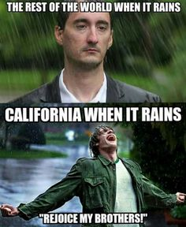

### Plan for Friday, Oct 14

#### Overview
  

Today you get another classifier!  This time, it's **Support Vector Machines (SVM)**.  Ling has done this lecture a number of times and has extra background here, so it should be a good one!

In the afternoon it's back to work.  Remember on McNulty you should really be having something classified at this point, at least a first pass.  You should also probably be thinking about what type of web page you might want to build to demonstrate your results (if you haven't already).  Make sure you **break out tasks** for each group member to work on, one of which could be to create the skeleton for that Flask app.

**Remember:**
* Luther Blogs are due **Today**
* 2-on-1s with Jason and Debbie (Day 2) are in the afternoon today
* Linear Splitting challenges are due **10/17**
* Linear Regression Challenges are due **10/17**:
* Challenges 5-6 are due **10/24**
* Fridays are for happiness

#### Schedule

**9:00 am**: Guten Morgen

**9:15 am**: Pair Programming:
  * Pair: [More Flask!](pair-flask-api-service.md)

Pairings:  

| Partner 1 | Partner 2 |
|------|-----|
| Nils | Kevin |
| Will | Kaushik |
| Veena | Catherine |
| Li | Bob |
| Rohan | Rebecca |
| Andrea | Josh |
| James | Chris |
| Daniel | Ron |
| Sarick | Travis |
| Zach | Jenn |
| Nick | Sam |
| Kyle | D.H. |

**10:15 am**: Machines with Vector Supports
* [SVM Part 1](SVM_Part1.pdf)
* [SVM Part 2](SVM_Part2.pdf)
* [SVM Exercises](SVM_digits.ipynb)

**12:00 pm**: Mittagessen

**1:30 pm**: Investigation Presentation: Catherine Henderson on...well Catherine is too nice for me to make fun of her lack of topic

**1:45 pm** WORK
* [Challenge 3: Train/Test Splits](/challenges/03-linear_splitting)
* [Challenge 4: Linear Regression and Learning Curves](/challenges/04-linear_learning)
* [McNulty](/projects/03-mcnulty)
* [Challenge 5: Classification](/challenges/05-classification)
* [Challenge 6: Classification Metrics](/challenges/06-classification_metrics)

**6:00 pm:** Auf Wiedersehen
