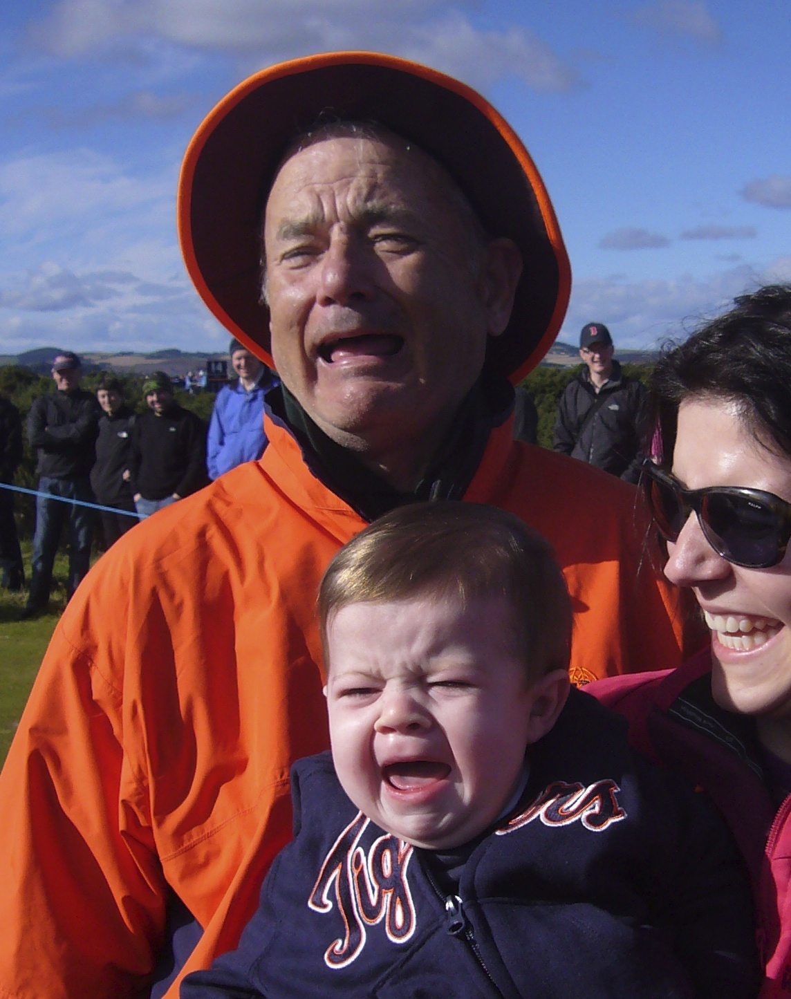

### Plan for Tue, Nov 15

#### Overview

Today we will answer the only question that matters, is this^ Bill Murray, or Tom Hanks? (Spoiler: It's obviously Bill Murray).  

Ling is going to show you some Convolutional Neural Nets and an application in Keras that might suggest how you tackle problems in Image Processing with Deep Learning.  This could include things like Facial Recognition, Emotion Detection, Image Classification, Image/Video Captioning (by combining with LSTMs!), etc.

**Important**:

Attendance right now is not acceptable.  We are going to discuss potential reward systems to implement to rectify that.  This is especially true when it comes to Speakers and other Careers events, which are **non-optional**.  I'd love to think we could just treat you all as adults in this respect, but if a reward/punishment system is required then we will go with that.

#### Schedule

**9:00 am**: Nice to you see human.

**9:15 am**: Pair Programming:  
  * [Dynamic Programming](pair-routes.md)   

Pairings:  

| Partner 1 | Partner 2 |
|------|-----|
| Bob | Catherine |
| D.H. | Kevin |
| Nils | Rebecca |
| Ron | Kaushik |
| Chris | Sam |
| Veena | Travis |
| Rohan | Josh |
| Andrea | Will |
| James | Li |
| Sarick | Jenn |
| Zach | Daniel |
| Kyle | Nick |

**10:15 am**: Deeeeeep Learning for Images with CNN!
* [Convolutional Neural Networks for Image Processing](dl_image.pdf)
* [Keras CNN Demo](keras-vgg16.ipynb)

**12:00 pm**: Go forth and feed

**1:30 pm**: Investigation Presentation: Zach on Computer Networks

**1:45 pm**: Work
* [Project 5: Kojak](/projects/05-kojak)

**5:00 pm:** Speaker: TBA, **Required**

**6:00 pm:** Now you may leave :smile:
