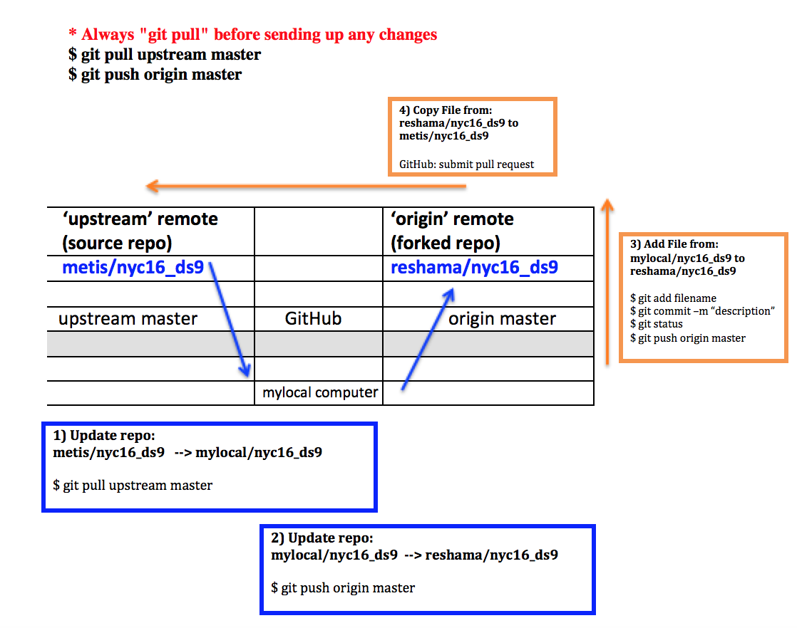

#Git and GitHub

####Bookmark these:  Reference Files for Git
 * In your favorite browser:  create a bookmark folder called "metis" and bookmark the following:  
https://github.com/thisismetis/nyc16_ds9  
 * Once you fork the repo, you will also want to book mark that.  Here's an example of my bookmark:  
https://github.com/reshama/nyc16_ds9

####[Setting up a credential manager (no more login when pushing/pulling)](https://help.github.com/articles/caching-your-github-password-in-git/)

---

 
